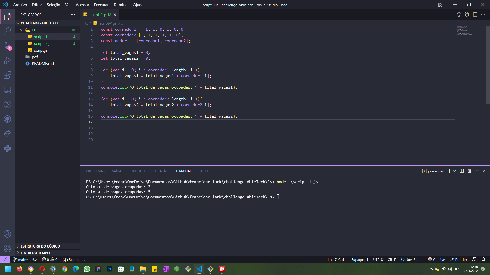
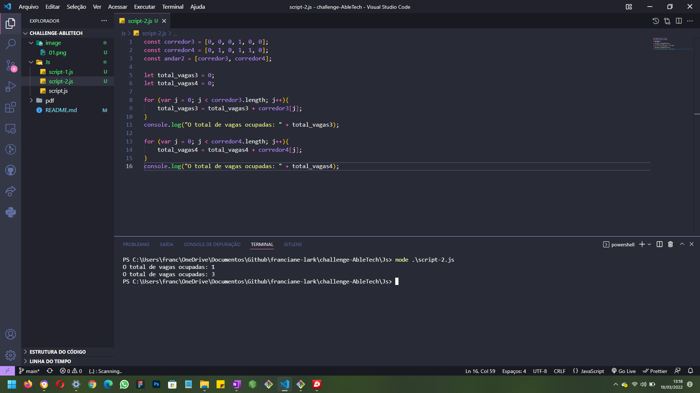
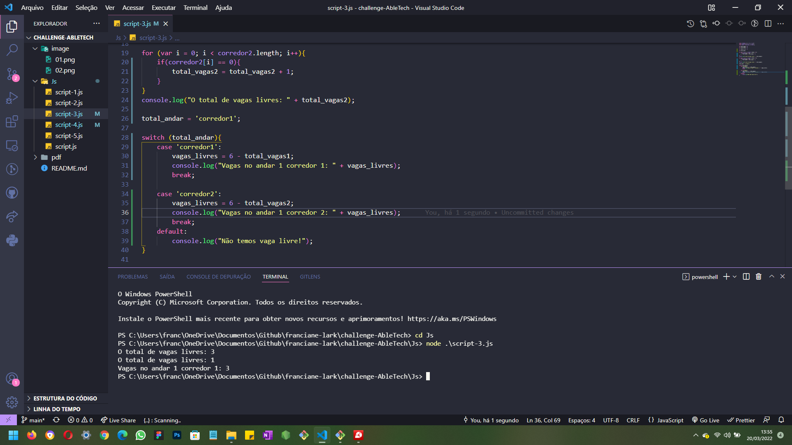
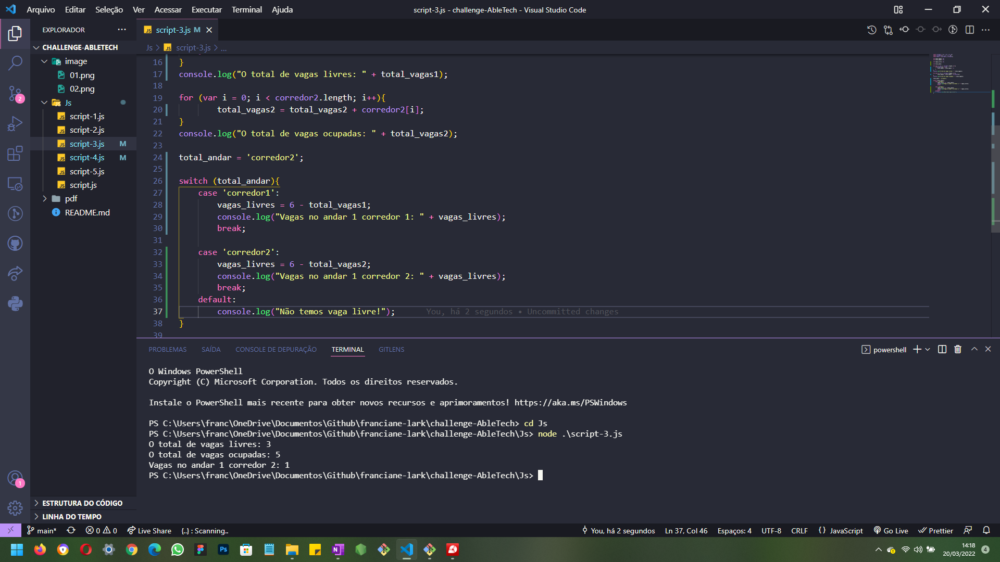
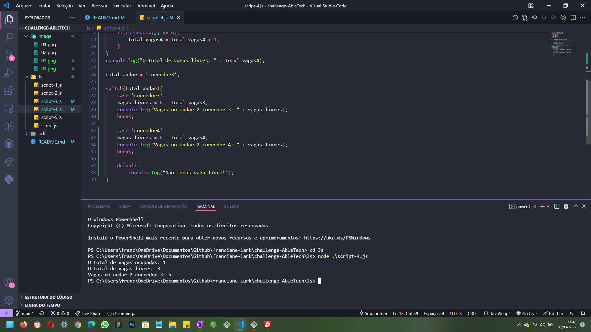
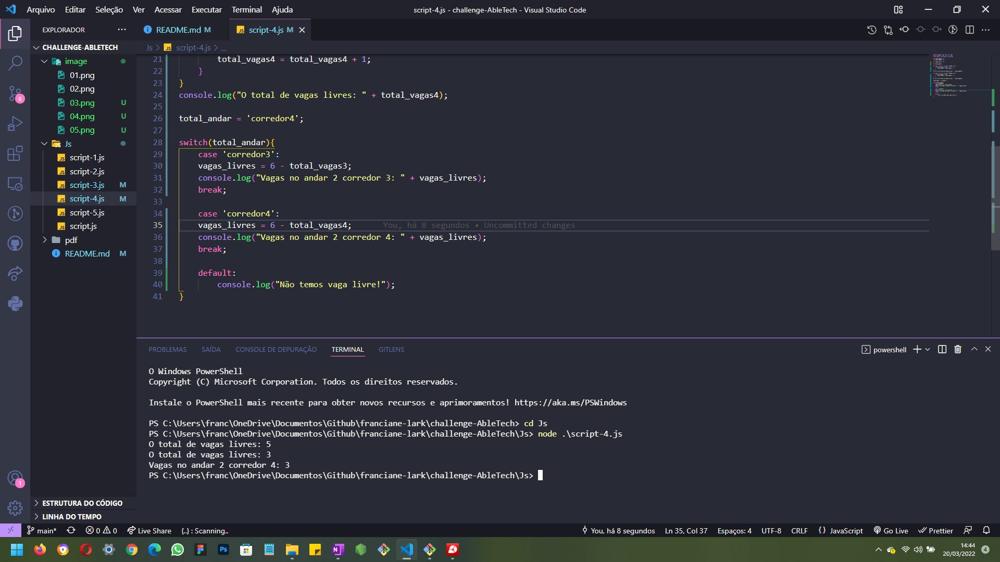
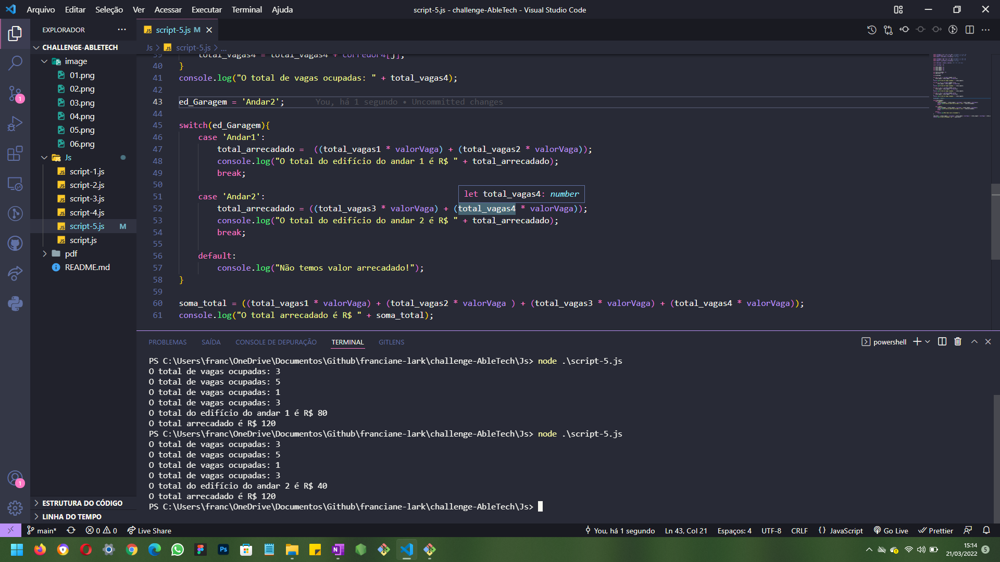

# Desafio Able Tech. | Franciane Lark | Entrega 25-03-2022.

- TRABALHAREMOS EM UM EDIFÍCIO GARAGEM, ONDE CADA ANDAR TERÁ CORREDORES E CADA CORREDOR TERÁ VAGAS, 
- VAGAS COM O NÚMERO 1 ESTÃO OCUPADAS E VAGAS COM O NÚMERO 0 ESTÃO LIVRES. 
- CADA VAGA OCUPADA CUSTA O VALOR DE 10 REAIS.
- DADO UM CORREDOR, RETORNAR O TOTAL DE VAGAS OCUPADAS
- DADO UM ANDAR, RETORNAR O TOTAL DE VAGAS LIVRES
- DADO UM EDIFÍCIO GARAGEM, RETORNAR O VALOR TOTAL ARRECADADO.

- <i> >> Comando terminal: Digitar cd Js depois node .\script.js (a depender de cada nome do arquivo javascript utilizado)</i>

# Respostas:

# 1. Corredor 1 e 2:

  

    - Utilizado o for para contar a quantidade de vagas ocupadas e mostrar na tela.

# 2. Corredor 3 e 4:

  

    - Utilizado o for para contar a quantidade de vagas ocupadas e mostrar na tela.

# 3. Andar 1:

  

  

    - Nas vagas livres, tive que verificar cada posição 0 dentro do vetor, para poder conseguir o total livres. Já no switch foi feito o cálculo tanto com as vagas livres e as vagas ocupadas, não consegui calcular só com as vagas livres, por isso o print aparece as vagas ocupadas, foi único jeito que eu consegui fazer o cálculo. (No caso o corredor 2 ficou com o valor de vagas ocupadas, para poder eu calcular)

# 4. Andar 2:

  

  

    - Nas vagas livres, tive que verificar cada posição 0 dentro do vetor, para poder conseguir o total livres. Já no switch foi feito o cálculo tanto com as vagas livres e as vagas ocupadas, não consegui calcular só com as vagas livres, por isso o print aparece as vagas ocupadas, foi único jeito que eu consegui fazer o cálculo. (No caso o corredor 3 ficou com o valor de vagas ocupadas, para poder eu calcular)

# 5. Edifício Garagem:

  

    - No final eu deixei o calculo no switch tanto do andar e a soma do valor total do edifício. Assim o usuário, pode ver de onde vem os valores antes da soma final.

